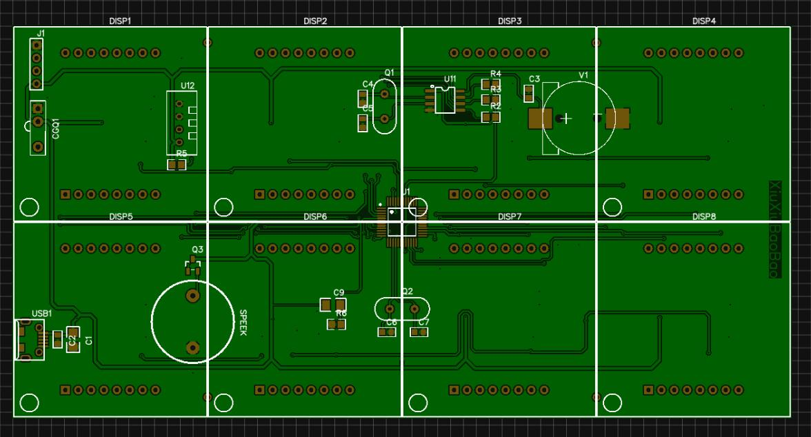
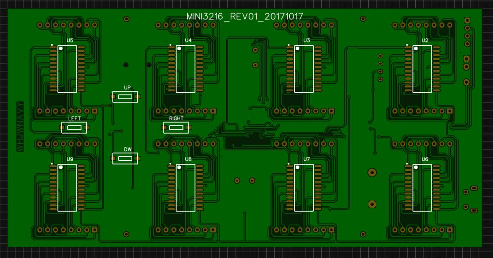
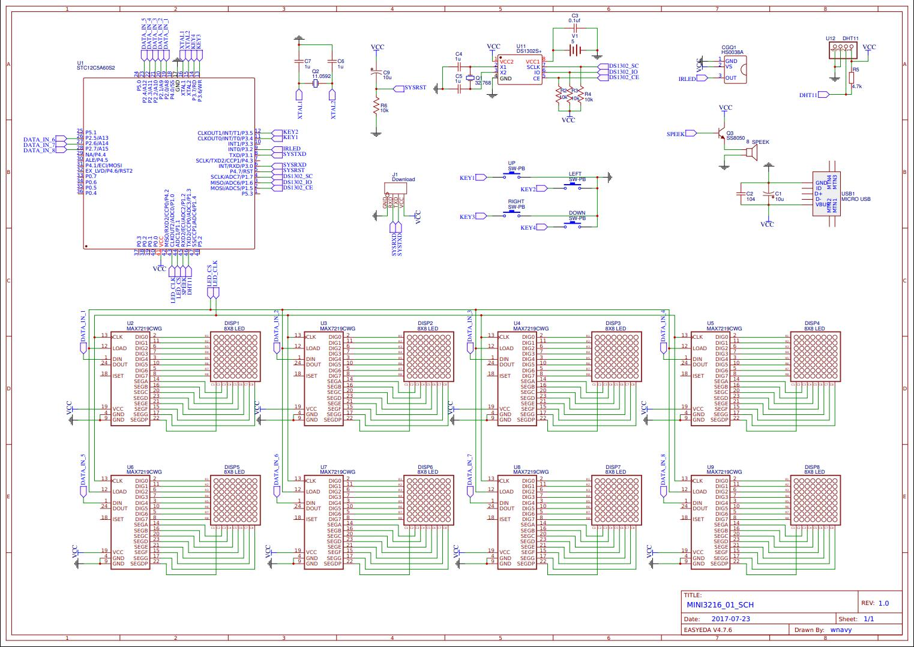
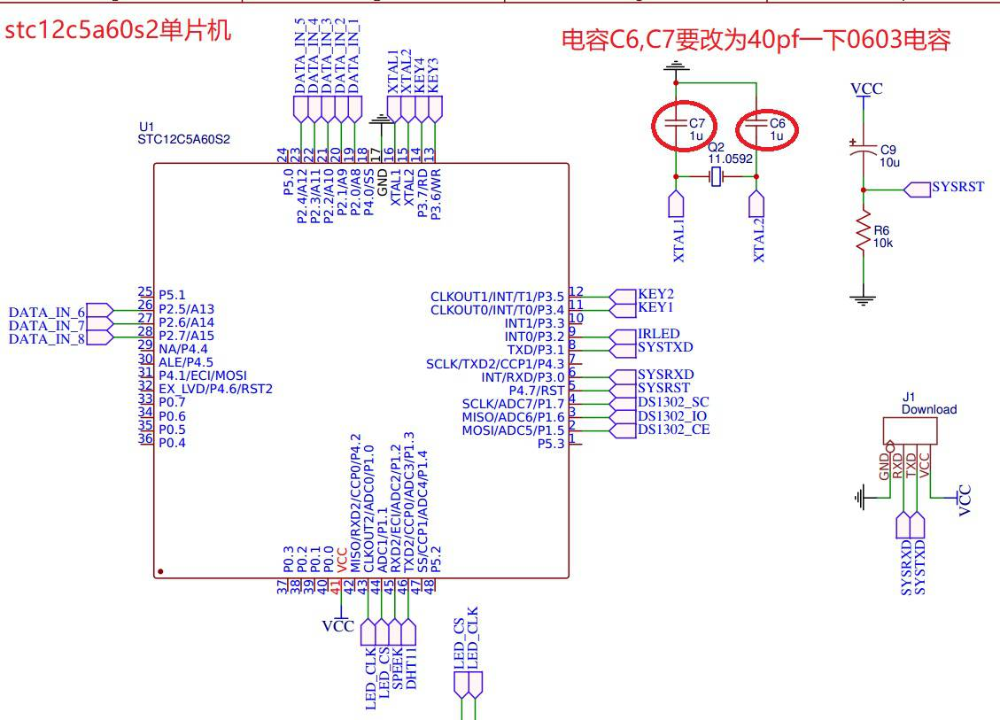
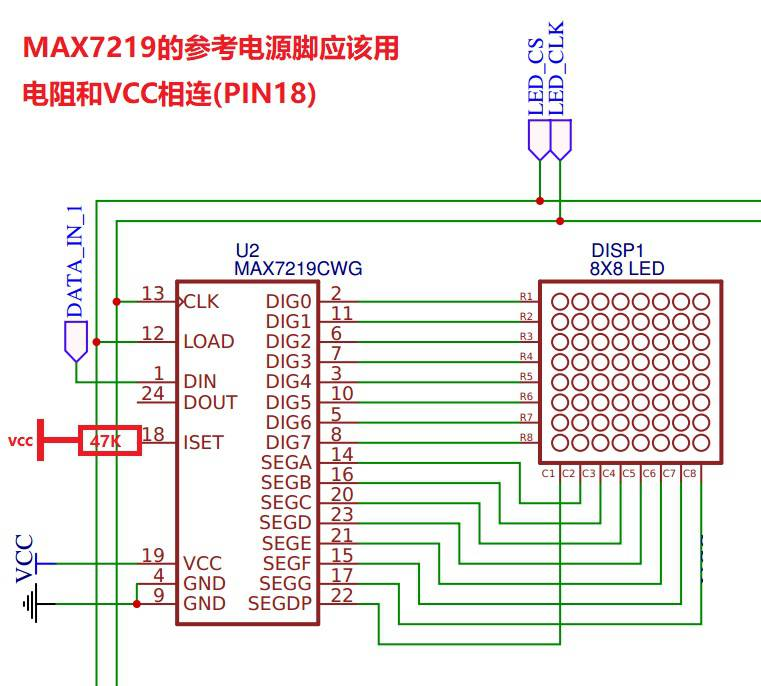
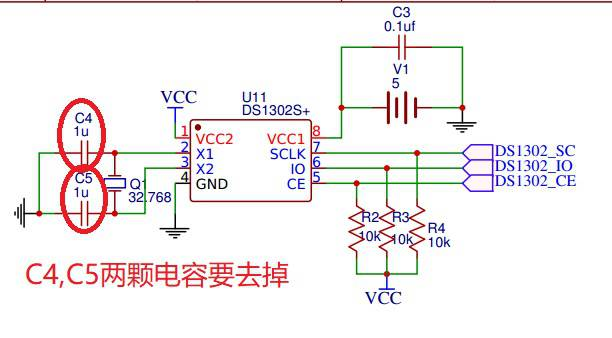
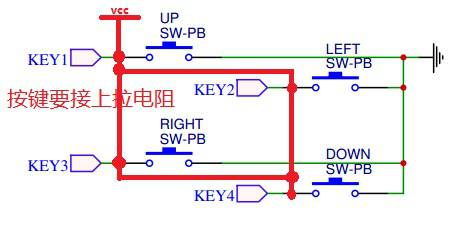
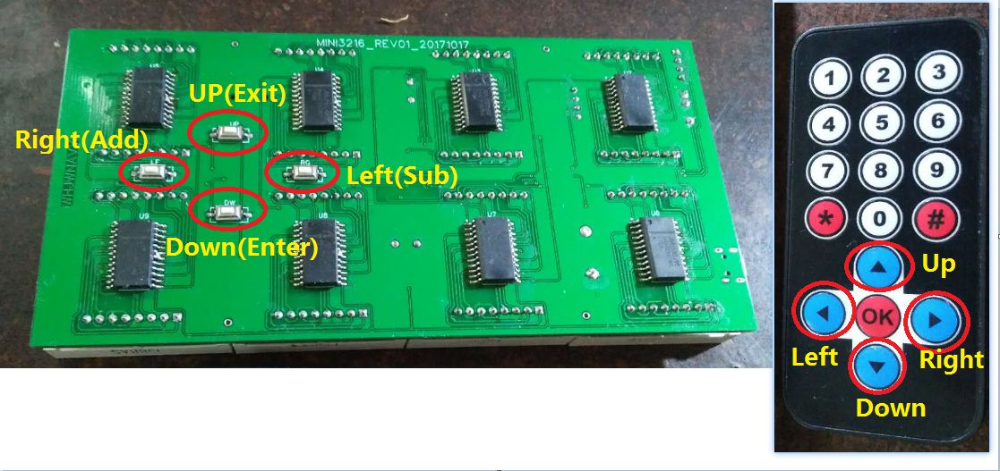
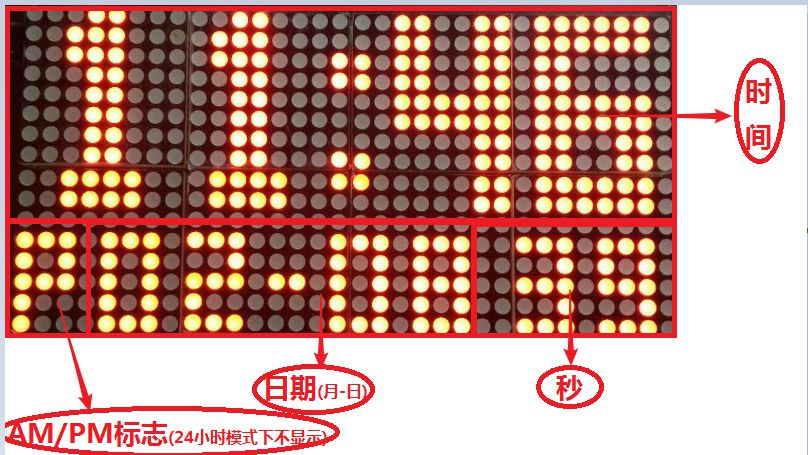
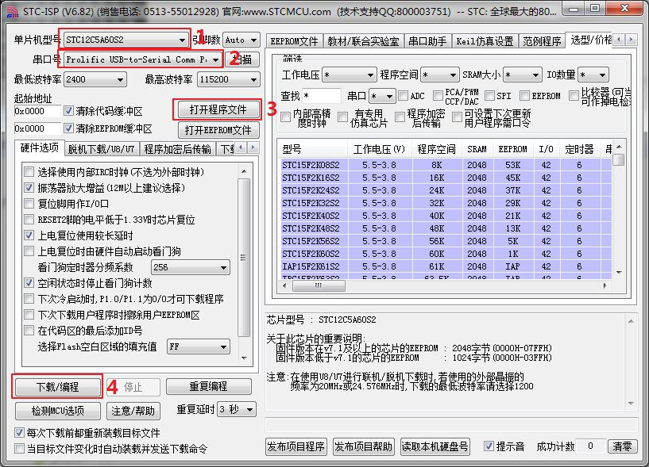

# 基于STC12C5A的MINI3216多功能点阵时钟

## 硬件详解
### PCB



### 硬件原理图


### 主控模块


### max7219模块


### ds1302模块


### 按键模块


## 源码详解

### 代码框架


### main.c
系统主函数模块,包含各种变量的定义及初始化,系统模块初始化和系统主循环.
系统主循环采用 *switch case状态机*  模式.状态机默认为主页模式, 在主循环中不断检测按键状态, 在状态机中根据按键状态改变状态机的模式.状态机主要有以下几种模式:

|状态机代码|含义|
|:---:|:---:|
|SYS_PAGE_MAIN|主界面|
|SYS_PAGE_MENU|菜单界面|
|SYS_PAGE_SET_CLOCK|时间设置界面|
|SYS_PAGE_SET_ALARM|闹钟设置界面|
|SYS_PAGE_SET_DATE|日期设置界面|
|SYS_PAGE_GET_TEMP|查看温度湿度界面|
|SYS_PAGE_SET_SYSTEM|设置界面|
|SYS_PAGE_PLAY_SNAKE|贪吃蛇游戏界面|
|SYS_PAGE_PLY_TETRIS|俄罗斯方块界面|
|SYS_PAGE_GET_SINFO|系统信息界面|
|SYS_PAGE_GET_NONLI|查看农历|
|SYS_PAGE_SET_BRTDY|生日设置|
|SYS_PAGE_POWER|关闭显示模式|
|SYS_PAGE_TEST_LED|屏幕测试模式|

```c
void main(void)
{
    /***********变量定义及初始化***********/
    uchar keycode = 0;//按键和红外的键值
    char setting_id = 0;//主菜单中被选中的项目

    uchar set_id = 0;//当前选中的设置项
    uchar set_op = 0;//设置操作:加或减
    uchar set_save = 0;//是否保存配置，1(Y)保存，0(N)不保存

    rtc_time_t time_t = {0};//用于保存获取到的当前时间
    rtc_time_t stime_t = {0};//用于保存获取到的当前时间
    rtc_time_t sdate_t = {0};//用于保存获取到的当前时间
    rtc_time_t alarm_t = {18, 6, 2, 24, 9, 0, 0};//用于保存闹钟时间和生日
    //char date_string[14] = {"2018-03-09 Fr"};//日期字符串
    system_cfg_t system_config_tmp = {0};//临时系统配置
    uchar dht_temp = 0, dht_humi = 0;//温湿度数据
    uchar main_page_temputer = 0;//用于模式2中的温度显示

	//状态机默认模式位主页模式
    uchar system_page = SYS_PAGE_MAIN;//用于指示当前系统界面

    uchar snake_life = 0;
    uchar snake_dir = 0;

    uchar tetris_life = 0;
    //uchar tetris_dir = 0;

    /***********系统模块初始化***********/
    led_init();//点阵屏初始化
    led_clear(0);//清屏
    irm_init();//红外初始化
    alarm_init(&alarm_t);//闹钟初始化

    system_config_init(&system_config_tmp);//初始化当前配置(默认值)
    system_config_get(&system_config_tmp);//从EEPROM中获取保存的配置
    system_config_apply(&system_config_tmp);//应用当前配置(配置到硬件中)

    //显示欢迎界面
    if(system_config_tmp.welcome)
    {
        led_scroll_puts_16x16(WELLCOME_LUNYU, WELLCOME_LUNYU_LEN, 0, 1);
        led_scroll_puts_16x16(WELLCOME_STRING, WELLCOME_STRING_LEN, 0, 1);
    }

    /***********系统主循环***********/
    while(1)
    {
        /***********检测按键状态***********/
        keycode = key_get_code();
        if(keycode != 0)
        {
            //总共需延时300ms但是为了不让按键音太长，分两次
            //sound_beep(1);//按键音
            //delay_xms(50);
            //sound_beep(0);
            sound_open(50);
            delay_xms(250);
        }

        /***********系统状态机***********/
        switch(system_page)
        {
            case SYS_PAGE_MENU://系统主菜单(图形界面),左右循环选择不同的菜单
                setting_id = show_entry_memu(MENU_ENTRY, MAX_MENU_ENTRY_ID, (uchar)setting_id);//显示子菜单图标
                if(keycode != 0)
                {
                    if(keycode == KEY_CODE_SUB)//向左翻页
                    {
                        setting_id--;//向左翻到第一页,继续翻会回到最后一页
                        if(setting_id < 0)
                        {
                            setting_id = MAX_MENU_ENTRY_ID;
                        }
                    }
                    else if(keycode == KEY_CODE_ADD)//向右翻页
                    {
                        setting_id++;//向右翻到最后一下,继续翻会回到第一页
                        if(setting_id > MAX_MENU_ENTRY_ID)
                        {
                            setting_id = 0;
                        }
                    }
                    else if((keycode == KEY_CODE_ENTER) ||
                            (keycode == KEY_CODE_OK))
                    {//按Enter(DOWN)键或OK键进入子菜单
                        set_id = 0;
                        set_op = 0;
                        set_save = 0;
                        switch(MENU_ENTRY[setting_id])
                        {
                            case CHN_CODE_CLOCK:
                                system_page = SYS_PAGE_SET_CLOCK;
                                break;
                            case CHN_CODE_ALARM:
                                system_page = SYS_PAGE_SET_ALARM;
                                break;
                            case CHN_CODE_DATE:
                                system_page = SYS_PAGE_SET_DATE;
                                break;
                            case CHN_CODE_BIRTHDAY:
                                set_id = SETDATE_ID_MONTH;//生日只需要设置月和日
                                system_page = SYS_PAGE_SET_BRTDY;
                                break;
                            case CHN_CODE_NONLI:
                                system_page = SYS_PAGE_GET_NONLI;
                                break;
                            case CHN_CODE_TEMP:
                                system_page = SYS_PAGE_GET_TEMP;
                                break;
                            case CHN_CODE_SNAKE:
                                //只有使用红外键盘的时候才能玩游戏
                                //只有红外键盘上有OK键
                                if(keycode == KEY_CODE_OK)
                                {
                                    snake_life = 0;
                                    system_page = SYS_PAGE_PLAY_SNAKE;
                                }
                                break;
                            case CHN_CODE_SETTING:
                                system_page = SYS_PAGE_SET_SYSTEM;
                                break;
                            case CHN_CODE_TETRIS:
                                tetris_life = 0;
                                system_page = SYS_PAGE_PLY_TETRIS;
                                break;
                            case CHN_CODE_SYSINFO:
                                system_page = SYS_PAGE_GET_SINFO;
                                break;
                            default:
                                //system_page = SYS_PAGE_MAIN;
                                break;
                        }

                    }
                    else if((keycode == KEY_CODE_EXIT)/*||
                            (keycode == KEY_CODE_ASTRSK) ||
                            (keycode == KEY_CODE_HSHTG)*/)
                    {
                        system_page = SYS_PAGE_MAIN;
                    }
                }
                break;
            case SYS_PAGE_SET_SYSTEM://系统设置菜单(文字界面),系统设置子菜单
                set_id = show_system_config(set_id, &system_config_tmp, set_op, &set_save);
                if(keycode != 0)
                {
                    if(keycode == KEY_CODE_ENTER)
                    {//循环设置各项,按Enter(Down)键进入下一项设置
                        set_id++;
                        if(set_id > MAX_SYSCFG_ID)
                        {
                            set_id = 0;
                        }
                    }
                    else if(keycode == KEY_CODE_SUB)
                    {
                        set_op = SET_OPER_SUB;
                    }
                    else if(keycode == KEY_CODE_ADD)
                    {
                        set_op = SET_OPER_ADD;
                    }
                    else if(keycode == KEY_CODE_EXIT)
                    {//按Exit(UP)键返回上一级菜单
                        system_page = /*SYS_PAGE_MAIN*/SYS_PAGE_MENU;
                        if(set_save == TRUE)
                        {//保存系统配置
                            system_config_set(&system_config_tmp);//保存配置信息
                            system_config_apply(&system_config_tmp);

                            // 电源和测试模式不能同时设置
                            if(system_config_tmp.led_power == 0)
                            {
                                system_page = SYS_PAGE_POWER;
                            }
                            else
                            {//测试模式必须在电源打开的情况下开启
                                if(system_config_tmp.led_test == 1)
                                {
                                    system_page = SYS_PAGE_TEST_LED;
                                }
                            }
                        }
                        else
                        {//未保存的时候，重新获取当前配置
                            system_config_get(&system_config_tmp);
                        }

                    }
                    else
                    {
                        set_op = 0;
                    }
                }
                else
                {
                    set_op = 0;
                }
                break;
            case SYS_PAGE_GET_SINFO://系统信息查看页面(文字界面)
                set_id = show_sinfo_config(set_id);
                if(keycode != 0)
                {
                    if(keycode == KEY_CODE_ENTER)
                    {//循环查看温度和湿度,按Enter(Down)键查看下一项
                        set_id++;
                        if(set_id > MAX_GETSINFO_ID)
                        {
                            set_id = 0;
                        }
                    }
                    else if(keycode == KEY_CODE_EXIT)
                    {//按Exit(UP)键返回上一级菜单
                        system_page = /*SYS_PAGE_MAIN*/SYS_PAGE_MENU;
                    }
                    else
                    {
                        set_op = 0;
                    }
                }
                else
                {
                    set_op = 0;
                }
                break;
            case SYS_PAGE_SET_CLOCK://时间设置页面(文字界面)
                set_id = show_time_config(set_id, &stime_t, set_op, &set_save);
                if(keycode != 0)
                {
                    if(keycode == KEY_CODE_ENTER)
                    {//循环设置各项,按Enter(Down)键进入下一项设置
                        set_id++;
                        if(set_id > MAX_SETTIME_ID)
                        {
                            set_id = 0;
                        }
                    }
                    else if(keycode == KEY_CODE_SUB)
                    {
                        set_op = SET_OPER_SUB;
                    }
                    else if(keycode == KEY_CODE_ADD)
                    {
                        set_op = SET_OPER_ADD;
                    }
                    else if(keycode == KEY_CODE_EXIT)
                    {//按Exit(UP)键返回上一级菜单
                        if(set_save == TRUE)
                        {//保存时间配置
                            set_save = FALSE;
                            //因为设置时间和日期是同时的,所以为了避免
                            //设置时间的时候误修改了日期,要先读取当前日期
                            rtc_read_time(&time_t);
                            stime_t.year = time_t.year;
                            stime_t.month = time_t.month;
                            stime_t.day = time_t.day;
                            stime_t.week = time_t.week;
                            rtc_set_time(&stime_t);
                        }
                        else
                        {
                            rtc_read_time(&stime_t);//恢复
                        }
                        system_page = /*SYS_PAGE_MAIN*/SYS_PAGE_MENU;
                    }
                    else
                    {
                        set_op = 0;
                    }
                }
                else
                {
                    set_op = 0;
                }
                break;
            case SYS_PAGE_SET_ALARM://闹钟设置页面(文字界面)
                set_id = show_time_config(set_id, &alarm_t, set_op, &set_save);

                if(keycode != 0)
                {
                    if(keycode == KEY_CODE_ENTER)
                    {//循环设置各项,按Enter(Down)键进入下一项设置
                        set_id++;
                        if(set_id > MAX_SETTIME_ID)
                        {//闹钟只需要设置时分秒
                            set_id = 0;
                        }
                    }
                    else if(keycode == KEY_CODE_SUB)
                    {
                        set_op = SET_OPER_SUB;
                    }
                    else if(keycode == KEY_CODE_ADD)
                    {
                        set_op = SET_OPER_ADD;
                    }
                    else if(keycode == KEY_CODE_EXIT)
                    {//按Exit(UP)键返回上一级菜单
                        if(set_save == TRUE)
                        {//保存闹钟配置
                            set_save = FALSE;
                            alarm_set_time(&alarm_t);
                        }
                        else
                        {
                            alarm_read_time(&alarm_t);
                        }
                        system_page = /*SYS_PAGE_MAIN*/SYS_PAGE_MENU;
                    }
                    else
                    {
                        set_op = 0;
                    }
                }
                else
                {
                    set_op = 0;
                }
                break;
            case SYS_PAGE_SET_DATE://日期设置页面(文字界面)
                set_id = show_date_config(set_id, &sdate_t, set_op, &set_save);
                if(keycode != 0)
                {
                    if(keycode == KEY_CODE_ENTER)
                    {//循环设置各项,按Enter(Down)键进入下一项设置
                        set_id++;
                        if(set_id > MAX_SETDATE_ID)
                        {
                            set_id = 0;
                        }
                    }
                    else if(keycode == KEY_CODE_SUB)
                    {
                        set_op = SET_OPER_SUB;
                    }
                    else if(keycode == KEY_CODE_ADD)
                    {
                        set_op = SET_OPER_ADD;
                    }
                    else if(keycode == KEY_CODE_EXIT)
                    {//按Exit(UP)键返回上一级菜单
                        if(set_save == TRUE)
                        {//保存日期配置
                            set_save = FALSE;
                            //因为设置时间和日期是同时的,所以为了避免
                            //设置日期的时候误修改了时间,要先读取当前时间
                            rtc_read_time(&time_t);
                            sdate_t.hour = time_t.hour;
                            sdate_t.minute = time_t.minute;
                            sdate_t.second = time_t.second;
                            rtc_set_time(&sdate_t);
                        }
                        else
                        {
                            rtc_read_time(&sdate_t);//恢复
                        }
                        system_page = /*SYS_PAGE_MAIN*/SYS_PAGE_MENU;
                    }
                    else
                    {
                        set_op = 0;
                    }
                }
                else
                {
                    set_op = 0;
                }
                break;
            case SYS_PAGE_SET_BRTDY://生日设置页面(文字界面)
                set_id = show_date_config(set_id, &alarm_t, set_op, &set_save);
                if(keycode != 0)
                {
                    if(keycode == KEY_CODE_ENTER)
                    {//循环设置各项,按Enter(Down)键进入下一项设置
                        set_id++;
                        if(set_id > MAX_SETDATE_ID)
                        {
                            set_id = SETDATE_ID_MONTH;
                        }
                    }
                    else if(keycode == KEY_CODE_SUB)
                    {
                        set_op = SET_OPER_SUB;
                    }
                    else if(keycode == KEY_CODE_ADD)
                    {
                        set_op = SET_OPER_ADD;
                    }
                    else if(keycode == KEY_CODE_EXIT)
                    {//按Exit(UP)键返回上一级菜单
                        if(set_save == TRUE)
                        {//保存生日配置
                            set_save = FALSE;
                            alarm_set_time(&alarm_t);//保存
                        }
                        else
                        {
                            alarm_read_time(&alarm_t);//恢复
                        }
                        system_page = /*SYS_PAGE_MAIN*/SYS_PAGE_MENU;
                    }
                    else
                    {
                        set_op = 0;
                    }
                }
                else
                {
                    set_op = 0;
                }
                break;
            case SYS_PAGE_GET_NONLI://查看农历页面(文字界面)
                set_id = show_nonli_config(set_id, &time_t);
                if(keycode != 0)
                {
                    if(keycode == KEY_CODE_ENTER)
                    {//循环设置各项,按Enter(Down)键进入下一项设置
                        set_id++;
                        if(set_id > MAX_GETNONLI_ID)
                        {
                            set_id = 0;
                        }
                    }
                    else if(keycode == KEY_CODE_EXIT)
                    {//按Exit(UP)键返回上一级菜单
                        system_page = /*SYS_PAGE_MAIN*/SYS_PAGE_MENU;
                    }
                    else
                    {
                        set_op = 0;
                    }
                }
                else
                {
                    set_op = 0;
                }
                break;
            case SYS_PAGE_GET_TEMP://温度查看页面(文字界面)
                set_id = show_temp_config(set_id, &dht_temp, &dht_humi);
                if(keycode != 0)
                {
                    if(keycode == KEY_CODE_ENTER)
                    {//循环查看温度和湿度,按Enter(Down)键查看下一项
                        set_id++;
                        if(set_id > MAX_GETTEMP_ID)
                        {
                            set_id = 0;
                        }
                    }
                    else if(keycode == KEY_CODE_EXIT)
                    {//按Exit(UP)键返回上一级菜单
                        system_page = /*SYS_PAGE_MAIN*/SYS_PAGE_MENU;
                    }
                    else
                    {
                        set_op = 0;
                    }
                }
                else
                {
                    set_op = 0;
                }
                break;
            case SYS_PAGE_PLAY_SNAKE://贪吃蛇游戏页面
                //物理按键太少,只有使用红外键盘的时候才能玩游戏
                if(snake_life == 0)//进入游戏,初始化游戏
                {
                    led_scroll_puts_8x16("    Start Game    ", 0, 1);
                    led_clear(0);
                    snake_game_init(3, DR_DOWN, 10, 1);
                    snake_life = LF_LIVE;
                }
                else if(snake_life == LF_DIE)//游戏结束,退出游戏
                {
                    led_scroll_puts_8x16("    Game Over    ", 0, 1);
                    led_clear(0);
                    snake_life = 0;
                    system_page = /*SYS_PAGE_MAIN*/SYS_PAGE_MENU;
                }
                else if(snake_life == LF_WIN)//游戏通关,退出游戏
                {
                    led_scroll_puts_8x16("    You Are Win    ", 0, 1);
                    led_clear(0);
                    snake_life = 0;
                    system_page = /*SYS_PAGE_MAIN*/SYS_PAGE_MENU;
                }
                else
                {//响应按键,控制贪吃蛇移动
                    if(keycode != 0)
                    {
                        if(keycode == KEY_CODE_UP)
                        {
                            snake_dir = DR_UP;
                        }
                        else if(keycode == KEY_CODE_DWN)
                        {
                            snake_dir = DR_DOWN;
                        }
                        else if(keycode == KEY_CODE_LFT)
                        {
                            snake_dir = DR_LEFT;
                        }
                        else if(keycode == KEY_CODE_RHT)
                        {
                            snake_dir = DR_RIGHT;
                        }
                        else if(keycode == KEY_CODE_NUM4)//允许穿墙
                        {
                            snake_set_crosswall(TRUE);
                        }
                        else if(keycode == KEY_CODE_NUM5)//禁止穿墙
                        {
                            snake_set_crosswall(FALSE);
                        }
                        else if(keycode == KEY_CODE_NUM1)//加速
                        {
                            snake_add_speed();
                        }
                        else if(keycode == KEY_CODE_NUM2)//减速
                        {
                            snake_sub_speed();
                        }
                        else if(keycode == KEY_CODE_OK)//暂停
                        {
                            while(TRUE)
                            {
                                keycode = key_get_code();
                                if(keycode != 0)
                                {
                                    //sound_beep(1);
                                    //delay_xms(50);
                                    //sound_beep(0);
                                    sound_open(50);
                                    if(keycode == KEY_CODE_OK)
                                    {
                                        keycode = 0;
                                        break;
                                    }
                                }
                            }
                        }
                        else if(keycode == KEY_CODE_NUM0)//退出
                        {
                            snake_life = 0;
                            system_page = SYS_PAGE_MENU;
                        }

                    }
                    snake_life = snake_move_control(snake_dir);//贪吃蛇移动
                    delay_xms(1000-(snake_get_speed()*100));//控制贪吃蛇移动速度(延时长短)
                }
                break;
            case SYS_PAGE_PLY_TETRIS://俄罗斯方块游戏页面
                if(tetris_life == 0)//进入游戏,初始化游戏
                {
                    led_scroll_puts_8x16("    Start Game    ", 0, 1);
                    led_clear(0);
                    tetris_game_init();
                    tetris_life = LF_LIVE;
                }
                else if(tetris_life == LF_DIE)//游戏结束,退出游戏
                {
                    led_scroll_puts_8x16("    Game Over    ", 0, 1);
                    led_clear(0);
                    tetris_life = 0;
                    system_page = /*SYS_PAGE_MAIN*/SYS_PAGE_MENU;
                }
                #if 0
                else if(tetris_life == LF_WIN)//游戏通关,退出游戏
                {
                    led_scroll_puts_8x16("    You Are Win    ", 0, 1);
                    led_clear(0);
                    tetris_life = 0;
                    system_page = /*SYS_PAGE_MAIN*/SYS_PAGE_MENU;
                }
                #endif
                else
                {//响应按键,控制俄罗斯方块移动
                    tetris_life = tetris_game_run();//俄罗斯方块运行
                    if(keycode != 0)
                    {
                        if(keycode == KEY_CODE_DWN)//变形
                        {
                            //tetris_dir = DR_DOWN;
                            tetris_shape_deform();
                        }
                        else if(keycode == KEY_CODE_LFT)//左移动
                        {
                            //tetris_dir = DR_LEFT;
                            tetris_shape_move(DR_LEFT);
                        }
                        else if(keycode == KEY_CODE_RHT)//右移动
                        {
                            //tetris_dir = DR_RIGHT;
                            tetris_shape_move(DR_RIGHT);
                        }
                        else if(keycode == KEY_CODE_NUM1)//加速
                        {
                            tetris_add_speed();
                        }
                        else if(keycode == KEY_CODE_NUM2)//减速
                        {
                            tetris_sub_speed();
                        }
                        else if(keycode == KEY_CODE_OK)//暂停
                        {
                            while(TRUE)
                            {
                                keycode = key_get_code();
                                if(keycode != 0)
                                {
                                    //sound_beep(1);
                                    //delay_xms(50);
                                    //sound_beep(0);
                                    sound_open(50);
                                    if(keycode == KEY_CODE_OK)
                                    {
                                        keycode = 0;
                                        break;
                                    }
                                }
                            }
                        }
                        else if(keycode == KEY_CODE_UP)//退出
                        {
                            tetris_life = 0;
                            system_page = SYS_PAGE_MENU;
                        }
                    }
                    delay_xms(1000-(tetris_get_speed()*100));//俄罗斯方块运行速度(延时长短)
                }
                break;
            case SYS_PAGE_POWER://待机模式页面,关闭屏幕显示
                led_clear(0);
                led_close();
                if(keycode != 0)
                {//按任意键退出
                    if((keycode <= KEY_MAX_CODE) &&
                       (keycode >= KEY_MIN_CODE))
                    {
                        system_page = SYS_PAGE_MAIN;
                        led_open();
                    }
                }
                break;
            case SYS_PAGE_TEST_LED://屏幕测试页面,LED全亮用于查看坏点
                led_clear(1);
                if(keycode != 0)
                {//按任意键退出,但是因为LD全亮的时候功耗较高,会导致供电
                 //不足,红外按键这时不起作用,只能通过背后的物理按键退出
                    if((keycode <= KEY_MAX_CODE) &&
                       (keycode >= KEY_MIN_CODE))
                    {
                        system_page = SYS_PAGE_MAIN;
                    }
                }
                break;
            case SYS_PAGE_MAIN://系统主界面，显示时间日期
                rtc_read_time(&time_t);//读取当前时间
                rtc_read_time(&stime_t);//读取当前时间
                rtc_read_time(&sdate_t);//读取当前日期
                alarm_read_time(&alarm_t);//读取闹钟设置

                if(system_config_tmp.mainpg_mode == CONFIG_MAIN_PG_WITH_TEMP)//主界面带温度模式
                {
                    if(dht11_get_value(&dht_temp, &dht_humi) == 0)
                    {
                        main_page_temputer = dht_temp;
                    }
                }
                led_put_main_page(&time_t, system_config_tmp.time_mode, main_page_temputer, 1, system_config_tmp.mainpg_mode);

                if(system_config_tmp.now_time != 0)//整点报时
                {
                    if((time_t.minute == 0) && (time_t.second == 0))//整点
                    {
                        sound_open(200);
                    }
                }

                if((time_t.hour == alarm_t.hour) &&
                   (time_t.minute == alarm_t.minute) &&
                   (time_t.second == alarm_t.second))
                {
                    sound_beep(1);//闹钟时间到
                }

                if(time_t.minute != alarm_t.minute)
                {
                    sound_beep(0);//一分钟之后自动结束闹钟
                }

                if((time_t.month == alarm_t.month) && (time_t.day == alarm_t.day) && (time_t.second == 0))//每隔一分钟显示一次生日快乐
                {
                    led_scroll_puts_8x16("    Happy Birthday    ", 0, 1);
                }

                if(keycode != 0)
                {
                    sound_beep(0);//任意键结束闹钟
                    if((keycode == KEY_CODE_ENTER) ||
                       (keycode == KEY_CODE_OK))//进入菜单
                    {
                        system_page = SYS_PAGE_MENU;
                        setting_id = 0;
                    }
                    #if 1
                    else if(keycode == KEY_CODE_HSHTG)// #键关闭显示,用于快速待机
                    {
                        system_page = SYS_PAGE_POWER;
                    }
                    #endif
                    else if(keycode == KEY_CODE_UP)//按UP键滚动显示日期
                    {
                        led_scroll_puts_8x16(get_date_string(&time_t), 5, 1);
                    }
                    else if(keycode == KEY_CODE_LFT)//按LIFT键滚动显示农历
                    {
                        led_scroll_puts_16x16(get_nonli_string(&time_t), NONLI_STRING_LEN, 5, 1);
                    }
                    else if(keycode == KEY_CODE_RHT)//按RIGHT键滚动显示温湿度
                    {
                        if(system_config_tmp.mainpg_mode
                            == CONFIG_MAIN_PG_WITH_TEMP)//主界面带温度模式
                        {
                            delay_xms(400);//两次读取dht11之间应该要有一定间隔，否则会出错(数据为0)
                        }
                        led_scroll_puts_8x16(get_temp_string(&dht_temp, &dht_humi), 5, 1);
                    }
                }
                break;
            default:
                break;
        }

        led_update();
        delay_xms(200);
    }
}
```

### common
系统通用模块, 包含基础头文件, 基本数据类型的定义, 以及以及基本通用函数的定义, 系统功能定义等
```c
#ifndef __COMMON_H__
#define __COMMON_H__

//#include <reg52.h>
#include <stc12c5a60s2.h>
#include <intrins.h>
#include <stdio.h>
#include <stdlib.h>

/*==========Typedef==========*/
#ifndef uchar
#define uchar   unsigned char
#endif

#ifndef uint
#define uint    unsigned int
#endif

#ifndef uint32
#define uint32   unsigned long int
#endif

#ifndef int32
#define int32   long int
#endif

#ifndef NULL
#define NULL    0
#endif

#ifndef OK
#define OK      0
#endif

#ifndef ERROR
#define ERROR   1
#endif

#ifndef TRUE
#define TRUE    1
#endif

#ifndef FALSE
#define FALSE   0
#endif

#ifndef RTN_ERR
#define RTN_ERR         (uchar)1//返回1
#endif

#ifndef RTN_OK
#define RTN_OK          (uchar)0//返回0
#endif

#ifndef RTN_NULL
#define RTN_NULL        (void*)0//返回NULL
#endif

#if 0
typedef unsigned char   uint8;
typedef signed char     int8;
typedef unsigned int    uint16;
typedef signed int      int16;
typedef unsigned long   uint32;
typedef signed long     int32;
#endif

typedef struct rtc_time_s
{
    uchar year;
    uchar week;
    uchar month;
    uchar day;
    uchar hour;//force 24 hour mode
    uchar minute;
    uchar second;
} rtc_time_t;

//方向
#define 	DR_UP       (uchar)0x10//0上
#define 	DR_DOWN     (uchar)0x11//1下
#define 	DR_LEFT     (uchar)0x12//2左
#define 	DR_RIGHT    (uchar)0x13//3右

//生命
#define     LF_LIVE     (uchar)0x20//0活着
#define     LF_DIE      (uchar)0x21//1死亡
#define     LF_WIN      (uchar)0x22//2胜利

/*==========Function Extern==========*/
/*****************************************************************************
 函 数 名  : delay_xms
 功能描述  : 毫秒延时
 输入参数  : x  延时时间,毫秒
 输出参数  : 无
 返 回 值  : 无
*****************************************************************************/
extern void delay_xms(uint x);

/*****************************************************************************
 函 数 名  : delay_xus
 功能描述  : 微秒延时
 输入参数  : x  延时时间,微秒
 输出参数  : 无
 返 回 值  : 无
*****************************************************************************/
extern void delay_xus(uint x);

/*****************************************************************************
 函 数 名  : _memset_
 功能描述  : 内存填充函数
 输入参数  : mem    要清除的内存首地址
             val    要填充的值
             sz     填充的长度
 输出参数  : 无
 返 回 值  : 无
*****************************************************************************/
extern void _memset_(uchar *mem, uchar val, uint sz);

/*****************************************************************************
 函 数 名  : _memcpy_
 功能描述  : 内存拷贝函数
 输入参数  : dst    目的内存地址
             src    源内存地址
             sz     拷贝的长度
 输出参数  : 无
 返 回 值  : 无
*****************************************************************************/
extern void _memcpy_(uchar *dst, uchar *src, uint sz);

/*****************************************************************************
 函 数 名  : _memcmp_
 功能描述  : 内存比较函数
 输入参数  : m1     源内存1
             m2     源内存2
             sz     要比较的长度
 输出参数  : 无
 返 回 值  : 0-相同, 非0-不同
*****************************************************************************/
extern char _memcmp_(uchar *m1, uchar *m2, uint sz);

/*****************************************************************************
 函 数 名  : _strlen_
 功能描述  : 计算字符串长度函数
 输入参数  : str    待计算的字符串
 输出参数  : 无
 返 回 值  : 字符串长度
*****************************************************************************/
extern uchar _strlen_(char *str);
//extern char _strcmp_(char *str0, char* str1);

/*****************************************************************************
 函 数 名  : sound_beep
 功能描述  : 蜂鸣器发声
 输入参数  : b    TRUE:声音开,FALSE:声音关
 输出参数  : 无
 返 回 值  : 无
*****************************************************************************/
extern void sound_beep(uchar b);

/*****************************************************************************
 函 数 名  : sound_beep
 功能描述  : 系统声音总开关
 输入参数  : b    TRUE:声音开,FALSE:声音关
 输出参数  : 无
 返 回 值  : 无
*****************************************************************************/
extern void sound_value(uchar v);

/*****************************************************************************
 函 数 名  : sound_open
 功能描述  : 游戏声音
 输入参数  : x  响铃时间,毫秒
 输出参数  : 无
 返 回 值  : 无
*****************************************************************************/
extern void sound_open(uint xms);

/*==========System Config==========*/
#define CONFIG_INCLUDE_FONT_EN_8X16     1//支持8x16英文字符
#define CONFIG_INCLUDE_FONT_EN_5X7      1//支持8x16英文字符
#define CONFIG_INCLUDE_FONT_CN_16X16    1//支持16x16图片(包括汉字)
#define CONFIG_INCLUDE_SCROLL_DISPLAY   1//支持滚动显示
#define CONFIG_INCLUDE_GAME_SNAKE       1//支持贪吃蛇游戏
#define CONFIG_INCLUDE_GAME_TETRIS      1//支持俄罗斯方块游戏
#define CONFIG_INCLUDE_IRM_HS0038       1//支持红外遥控
#define CONFIG_INCLUDE_RTC_DS1302       1//支持DS1302时钟芯片
#define CONFIG_INCLUDE_TEMP_DHT11       1//支持DHT11温湿度传感器
#define CONFIG_INCLUDE_CHNIA_NONLI      1//支持农历


#define CONFIG_MAIN_PG_WITH_SECOND     (uchar)0x01//主页模式:右下角显示秒
#define CONFIG_MAIN_PG_WITH_WEEK       (uchar)0x02//主页模式:右下角显示星期(1-7)
#define CONFIG_MAIN_PG_WITH_TEMP       (uchar)0x03//主页模式:右下角显示温度

#define CONFIG_DEFAULT_MAIN_PG         CONFIG_MAIN_PG_WITH_SECOND//正常模式
#define CONFIG_DEFAULT_LED_LIGHT       (uchar)0x00//默认亮度,0,最低
#define CONFIG_DEFAULT_TIME_MODE       (uchar)0x00//默认小时制,12小时制

//#define CONFIG_PRODUCT_XIUBAOBAO        1
//#define CONFIG_PRODUCT_WEIXIN           1
//#define CONFIG_PRODUCT_YUHONGQIANG      1

#define SYSTEM_SOFTWARE_VERSION         "V:v9r3"//软件版本, versiong 9, release 3
#define SYSTEM_HARDWARE_VERSION         "V:v1r5"//硬件版本, versiong 1, release 5
#define SYSTEM_RELVERSION_TIME          "180310"//发布时间

#if defined CONFIG_PRODUCT_XIUBAOBAO
    #define SYSTEM_RELVERSION_CUST          "BAOBAO"//客户
#elif defined CONFIG_PRODUCT_WEIXIN
    #define SYSTEM_RELVERSION_CUST          "WEIXIN"//客户
#elif defined CONFIG_PRODUCT_YUHONGQIANG
    #define SYSTEM_RELVERSION_CUST          " YUHQ "//客户
#else
    #define SYSTEM_RELVERSION_CUST          " WNAVY"//客户
#endif
#endif
```
### drv_led
点阵屏驱动模块，本系统有八块8x8点阵组成, 分辨率为32x16,采用8片max7219驱动芯片驱动. 本系统并没有采用8片max7219级联的方式, 而是8片max7219的CLK和LOAD引脚共用, 分别接在STC122C5A单片机的P1.0和P1.1引脚上. 8个DIN引脚分别接在STC122C5A单片机的P2.0 - P2.7引脚上.
```c
#ifndef __DRV_LED_H__
#define __DRV_LED_H__
#include "common.h"

#define LED_MAX_X   32
#define LED_MAX_Y   16

#define LED_PUT_BLOCK_2X2(x, y, col)   \
do                                     \
{                                      \
    led_set_point((x),   (y),   (col));\
    led_set_point((x+1), (y),   (col));\
    led_set_point((x),   (y+1), (col));\
    led_set_point((x+1), (y+1), (col));\
}while(0)

/*****************************************************************************
 函 数 名  : led_init
 功能描述  : max7219初始化
 输入参数  : void  
 输出参数  : 无
 返 回 值  : 无
*****************************************************************************/
extern void led_init(void);

/*****************************************************************************
 函 数 名  : led_open
 功能描述  : max7219打开显示(硬件)
 输入参数  : void  
 输出参数  : 无
 返 回 值  : 无
*****************************************************************************/
extern void led_open(void);

/*****************************************************************************
 函 数 名  : led_close
 功能描述  : max7219关闭显示(硬件)
 输入参数  : void  
 输出参数  : 无
 返 回 值  : 无
*****************************************************************************/
extern void led_close(void);

/*****************************************************************************
 函 数 名  : led_set_light
 功能描述  : 设置显示亮度
 输入参数  : uchar n  亮度值(0-15)
 输出参数  : 无
 返 回 值  : 无
*****************************************************************************/
extern void led_set_light(uchar n);

/*****************************************************************************
 函 数 名  : led_update
 功能描述  : 把显存中的数据写入硬件(max7219)中
 输入参数  : void  
 输出参数  : 无
 返 回 值  : 无
*****************************************************************************/
extern void led_update(void);

/*****************************************************************************
 函 数 名  : led_clear
 功能描述  : 用制定颜色填充(刷新)显存
 输入参数  : uchar dat  指定颜色,0:不显示(黑色),非0:显示(白色)
 输出参数  : 无
 返 回 值  : 无
*****************************************************************************/
extern void led_clear(uchar dat);

/*****************************************************************************
 函 数 名  : led_set_point
 功能描述  : 设置显存中指定坐标点的颜色
 输入参数  : uchar x    显存中指定点的x坐标[0-32)
             uchar y    显存中指定点的y坐标[0-16)
             uchar dat  坐标点的颜色,0:不显示(黑色),非0:显示(白色)
 输出参数  : 无
 返 回 值  : 无
*****************************************************************************/
extern void led_set_point(uchar x, uchar y, uchar dat);

/*****************************************************************************
 函 数 名  : led_get_point
 功能描述  : 获取显存中指定坐标点的颜色
 输入参数  : uchar x    显存中指定点的x坐标[0-32)
             uchar y    显存中指定点的y坐标[0-16)
 输出参数  : 无
 返 回 值  : 坐标点的颜色,0:不显示(黑色),非0:显示(白色)
*****************************************************************************/
extern uchar led_get_point(uchar x, uchar y);
#if 0
extern void     open_door(void);
extern void     closed_door(void);
#endif

#ifdef CONFIG_INCLUDE_FONT_EN_8X16
/*****************************************************************************
 函 数 名  : led_putc_8x16
 功能描述  : 显示一个8x16的字符图像(只写入显存,不更新硬件)
 输入参数  : uchar x_pos  要显示的字符图像的x坐标(y坐标为0)
             char chr     需要显示的字符的ascii码
             uchar color  颜色反转,0-阴文,非0-阳文
 输出参数  : 无
 返 回 值  : 0-成功,1-失败
*****************************************************************************/
extern uchar led_putc_8x16(uchar x_pos, char chr, uchar color);

/*****************************************************************************
 函 数 名  : led_puts_8x16
 功能描述  : 显示一个8x16的字符串图像(只写入显存,不更新硬件)
 输入参数  : uchar x_pos  要显示的字符串的x坐标(y坐标为0)
             char chr     需要显示的字符的指针
             uchar color  颜色反转,0-阴文,非0-阳文
 输出参数  : 无
 返 回 值  : 0-成功,1-失败
*****************************************************************************/
extern uchar led_puts_8x16(uchar x_pos, char *str, uchar color);

//extern void led_put_8x16_with_02x(uchar x, uchar hex, uchar col);

#ifdef CONFIG_INCLUDE_SCROLL_DISPLAY
/*****************************************************************************
 函 数 名  : led_scroll_puts_8x16
 功能描述  : 滚动(向左)显示一个8x16的字符串
 输入参数  : char *str   要显示的字符串的指针
             uint delay  滚动延时时间(ms)
             uchar color 颜色反转,0-阴文,非0-阳文
 输出参数  : 无
 返 回 值  : 0-成功,1-失败
*****************************************************************************/
extern uchar led_scroll_puts_8x16(char *str, uint delay, uchar color);
#endif
#endif

#ifdef CONFIG_INCLUDE_FONT_CN_16X16

/*****************************************************************************
 函 数 名  : led_putc_16x16
 功能描述  : 显示一个8x16的字符图像(只写入显存,不更新硬件)
 输入参数  : uchar x_pos  要显示的字符图像的x坐标(y坐标为0)
             char chr     要显示的字符的图形码
             uchar color  颜色反转,0-阴文,非0-阳文
 输出参数  : 无
 返 回 值  : 0-成功,1-失败
*****************************************************************************/
extern uchar led_putc_16x16(uchar x_pos, uchar chr, uchar color);

/*****************************************************************************
 函 数 名  : led_puts_16x16
 功能描述  : 显示一个16x16的字符串图像(只写入显存,不更新硬件)
 输入参数  : uchar x_pos  要显示的字符串的x坐标(y坐标为0)
             char* chr    要显示的图形的图形数组指针
             uchar len    要显示的图形码数组的长度
             uchar color  颜色反转,0-阴文,非0-阳文
 输出参数  : 无
 返 回 值  : 0-成功,1-失败
*****************************************************************************/
extern uchar led_puts_16x16(uchar x_pos, uchar *chr, uchar len, uchar color);

#ifdef CONFIG_INCLUDE_SCROLL_DISPLAY
/*****************************************************************************
 函 数 名  : led_scroll_puts_16x16
 功能描述  : 滚动(向左)显示一个8x16的字符串
 输入参数  : char *chr   要显示的图形码数组的指针
             uchar len   要显示的图形码数组的长度
             uint delay  滚动延时时间(ms)
             uchar color 颜色反转,0-阴文,非0-阳文
 输出参数  : 无
 返 回 值  : 0-成功,1-失败
*****************************************************************************/
extern uchar led_scroll_puts_16x16(uchar *chr, uchar len, uint delay, uchar color);
#endif
#endif

/*****************************************************************************
 函 数 名  : led_put_small_num
 功能描述  : 显示一个7x11或4x5的数字
 输入参数  : uchar x       显示位置
             uchar y       显示位置
             uchar num     要现实的数字(只能显示一位，所以必须<10)
             uchar color   颜色反转,0-阴文,非0-阳文
             uchar fnt_md  0: 4x5字体, 非0: 7x11字体
 输出参数  : 无
 返 回 值  : 0-成功,1-失败
*****************************************************************************/
extern uchar led_put_small_num(uchar x, uchar y, uchar num, uchar color, uchar fnt_md);

/*****************************************************************************
 函 数 名  : led_put_main_page
 功能描述  : 全屏显示时间、日期、星期、秒、温度等信息
 输入参数  : rtc_time_t *ttime  时间日期(时间采用24小时制)
             uchar tmd_24h      是否使用24小时模式, 非0-24小时制, 0-12小时制
             uchar temp         温度,当不使用带温度模式的时候，此参数填0
             uchar color        颜色反转,0-阴文,非0-阳文
             uchar mpg_mod      附加显示:星期(0-7)或温度(0-99)或秒(0-59)
 输出参数  : 无
 返 回 值  : 
*****************************************************************************/
extern uchar led_put_main_page(rtc_time_t *ttime, uchar tmd_24h, uchar temp, uchar color, uchar mpg_mod);

#ifdef CONFIG_INCLUDE_FONT_EN_5X7
/*****************************************************************************
 函 数 名  : led_putc_5x7
 功能描述  : 显示一个5x7的字符图像(只写入显存,不更新硬件)
 输入参数  : uchar x_pos  要显示的字符图像的x坐标(y坐标为0)
             char chr     需要显示的字符的ascii码
             uchar color  颜色反转,0-阴文,非0-阳文
 输出参数  : 无
 返 回 值  : 0-成功,1-失败
*****************************************************************************/
extern uchar led_putc_5x7(uchar c_pos, uchar r_pos, char chr, uchar color);
extern uchar led_putc_5x7_undline(uchar c_pos, uchar r_pos, char chr, uchar color, uchar undline);

/*****************************************************************************
 函 数 名  : led_puts_5x7
 功能描述  : 显示一个5x7的字符串图像(只写入显存,不更新硬件)
 输入参数  : uchar x_pos  要显示的字符串的x坐标(y坐标为0)
             char chr     需要显示的字符的指针
             uchar color  颜色反转,0-阴文,非0-阳文
 输出参数  : 无
 返 回 值  : 0-成功,1-失败
*****************************************************************************/
extern uchar led_puts_5x7(uchar c_pos, uchar r_pos, char *str, uchar color);
extern uchar led_puts_5x7_undline(uchar c_pos, uchar r_pos, char *str, uchar color, uchar undline);

#ifdef CONFIG_INCLUDE_SCROLL_DISPLAY
/*****************************************************************************
 函 数 名  : led_scroll_puts_5x7
 功能描述  : 滚动(向左)显示一个5x7的字符串
 输入参数  : char *str   要显示的字符串的指针
             uint delay  滚动延时时间(ms)
             uchar color 颜色反转,0-阴文,非0-阳文
 输出参数  : 无
 返 回 值  : 0-成功,1-失败
*****************************************************************************/
extern uchar led_scroll_puts_5x7(char *str, uint delay, uchar color, uchar r_pos);
#endif
#endif

#endif

```
### drv_cfgsave
系统参数保存模块, 用于保存系统设置参数,以防掉电丢失. 数据保存在STC12C5A的内部EEPROM上. 
STC12C5A内部EEPROM共有两个bank, 每个bank512字节, 系统参数保存在第一个bank(bank0)上, 起始地址为0x0000. 
因为eeprom只能按bank擦除, 所以当每次参数发生改变重新保存的时候, 都会擦除整个bank0, 然后把新的数据(全部)重新写入到eeprom中.
系统参数从bank0的0x0005地址开始保存, 前五个字节用于保存参数标志"WNAVY".
每次开机的时候总是会从eeprom中读取保存的参数, 并根据保存的系统配置参数设置系统.
```c
#ifndef __DRV_CFGSAVE_H__
#define __DRV_CFGSAVE_H__

#include "common.h"

/*****************************************************************************
 函 数 名  : cfgsave_read
 功能描述  : 从内部eeprom中读取配置
 输入参数  : len    要读区的配置区的长度(字节)
 输出参数  : config 指向保存配置的指针
 返 回 值  : RTN_OK-成功，RTN_ERR-失败
*****************************************************************************/
uchar cfgsave_read(uchar* config, uint len);

/*****************************************************************************
 函 数 名  : cfgsave_write
 功能描述  : 把配置保存到内部eeprom中
 输入参数  : config 指向保存配置的指针
             len    要读区的配置区的长度(字节)
 输出参数  : 无
 返 回 值  : RTN_OK-成功，RTN_ERR-失败
*****************************************************************************/
uchar cfgsave_write(uchar* config, uint len);

#endif
```
### drv_1302
DS1302实时时钟驱动模块, DS1302采用IIC接口读写数据, 本机采用GPIO模拟IIC时序的方式来读写DS1302, DS1302的CLK, IO, CE引脚分别STC122C5A单片机的P1.7, P1.6, P1.5引脚上. 为了简化DS1302驱动模块, DS1302驱动默认只采用24小时模式来读取和配置, 关于12小时和24小时的转换由软件完成.
```c
#ifndef __DRV_1302_H__
#define __DRV_1302_H__

#include "common.h"

#ifdef CONFIG_INCLUDE_RTC_DS1302

/*****************************************************************************
 函 数 名  : rtc_set_time
 功能描述  : 设置当前时间
 输入参数  : time   要设置的时间
 输出参数  : 无
 返 回 值  : 无
*****************************************************************************/
extern void rtc_set_time(rtc_time_t* time);

/*****************************************************************************
 函 数 名  : rtc_read_time
 功能描述  : 获取当前时间
 输入参数  : void
 输出参数  : time   读取到的闹钟时间
 返 回 值  : 无
*****************************************************************************/
extern void rtc_read_time(rtc_time_t* time);

/*****************************************************************************
 函 数 名  : alarm_set_time
 功能描述  : 设置闹钟时间
 输入参数  : time   要设置的闹钟时间
 输出参数  : 无
 返 回 值  : 无
*****************************************************************************/
extern void alarm_set_time(rtc_time_t* time);

/*****************************************************************************
 函 数 名  : alarm_read_time
 功能描述  : 获取闹钟时间
 输入参数  : 无
 输出参数  : time   要设置的闹钟时间
 返 回 值  : 无
*****************************************************************************/
extern void alarm_read_time(rtc_time_t* time);

/*****************************************************************************
 函 数 名  : alarm_set_flag
 功能描述  : 设置闹钟开关
 输入参数  : b      闹钟开启标志
 输出参数  : 无
 返 回 值  : 无
*****************************************************************************/
extern void alarm_set_flag(uchar b);

/*****************************************************************************
 函 数 名  : alarm_get_flag
 功能描述  : 获取闹钟开关
 输入参数  : 无
 输出参数  : 无
 返 回 值  : 闹钟开启标志
*****************************************************************************/
extern uchar alarm_get_flag(void);

/*****************************************************************************
 函 数 名  : alarm_beep
 功能描述  : 控制闹钟响铃
 输入参数  : b      闹钟开始响铃
 输出参数  : 无
 返 回 值  : 无
*****************************************************************************/
extern void alarm_init(rtc_time_t* alarm);

/*****************************************************************************
 函 数 名  : alarm_init
 功能描述  : 闹钟初始化
 输入参数  : alarm  初始化时读取保存的闹钟时间
 输出参数  : 无
 返 回 值  : 无
*****************************************************************************/
//extern void alarm_beep(uchar b);
//#define alarm_beep(b)   sound_beep(b)
#endif

#endif
```

### drv_irm
红外按键驱动模块, 一体化红外接收头的DATA引脚接在STC122C5A单片机的P3.2引脚上.
红外键盘发送数据时将数据调制在38KHZ的载波上, 红外接收头接收到载波数据后会自动解调出载波中的数据. 
P3.2引脚具有外部中断功能, 当红外接收到数据后接收头的输出脚开始输出电平,进而出发外部中断(中断号0), 在外部中断0中配合红外定时器(timer0)可以测量红外高低电平持续时间,从而转化成数字0或1,追后解码出红外按键码.
本机带有四个物理按键(UP, DOWN, LEFT, RIGHT), 物理按键通过定时器中断(timer1)轮询检测, 为了简化按键处理程序, 物理按键和红外按键公用四个键值码.
详见 [红外遥控器工作原理](https://blog.csdn.net/techelefeng/article/details/45972583)
```c
#ifndef __DRV_IRM_H__
#define __DRV_IRM_H__

#include "common.h"

#ifdef CONFIG_INCLUDE_IRM_HS0038

#define KEY_USR_CODE0       0x00
#define KEY_USR_CODE1       0xFF

//红外键值码
#define KEY_CODE_NUM1       0x45
#define KEY_CODE_NUM2       0x46
#define KEY_CODE_NUM3       0x47
#define KEY_CODE_NUM4       0x44
#define KEY_CODE_NUM5       0x40
#define KEY_CODE_NUM6       0x43
#define KEY_CODE_NUM7       0x07
#define KEY_CODE_NUM8       0x15
#define KEY_CODE_NUM9       0x09
#define KEY_CODE_NUM0       0x19
#define KEY_CODE_ASTRSK     0x16//星号
#define KEY_CODE_HSHTG      0x0D//井号
#define KEY_CODE_OK         0x1C//上
//物理按键和红外按键公用键值码
#define KEY_CODE_UP         0x18//上
#define KEY_CODE_DWN        0x52//下
#define KEY_CODE_LFT        0x08//左
#define KEY_CODE_RHT        0x5A//右

#define KEY_CODE_ADD        KEY_CODE_RHT//+
#define KEY_CODE_SUB        KEY_CODE_LFT//-

#define KEY_CODE_ENTER      KEY_CODE_DWN//Enter
#define KEY_CODE_EXIT       KEY_CODE_UP//Enter

#define KEY_MAX_CODE        KEY_CODE_RHT
#define KEY_MIN_CODE        KEY_CODE_NUM7

/*****************************************************************************
 函 数 名  : irm_init
 功能描述  : 红外接收初始化,初始化定时器,中断
 输入参数  : 无
 输出参数  : 无
 返 回 值  : 无
*****************************************************************************/
extern void     irm_init(void);

/*****************************************************************************
 函 数 名  : key_get_code
 功能描述  : 获取按键值,获取完之后立即置0,按键一次,软件中重复多次获取到键值
 输入参数  : 无
 输出参数  : 无
 返 回 值  : 无
*****************************************************************************/
extern uchar    key_get_code(void);

#endif

#endif
```

### drv_dht11
DHT11温湿度传感器驱动模块, DHT11的数据引脚接在STC122C5A单片机的P1.3引脚上. 两次读取数据之间的间隔不能小于2秒,否则读取数据会出错.
```c
#ifndef __DRV_DHT11_H__
#define __DRV_DHT11_H__

#include "common.h"

#ifdef CONFIG_INCLUDE_TEMP_DHT11

#if 0
/*****************************************************************************
 函 数 名  : dht11_get_temp
 功能描述  : 获取温度并返回,读取模块数据周期不易小于 2S
 输入参数  : void
 输出参数  : 无
 返 回 值  : 温度
*****************************************************************************/
extern uchar dht11_get_temp(void);

/*****************************************************************************
 函 数 名  : dht11_get_humi
 功能描述  : 获取湿度并返回,读取模块数据周期不易小于 2S
 输入参数  : void
 输出参数  : 无
 返 回 值  : 湿度
*****************************************************************************/
extern uchar dht11_get_humi(void);//获取湿度
#endif

/*****************************************************************************
 函 数 名  : dht11_get_value
 功能描述  : 从dht11模块获取温度和湿度
 输入参数  : 无
             无
 输出参数  : uchar* temp  温度
             uchar* humi  湿度
 返 回 值  : 0-成功，1-失败
*****************************************************************************/
extern uchar dht11_get_value(uchar *temp, uchar *humi);

#endif

#endif
```

### china_nonli
公历转农历模块, 由网络上的开源代码修改而来.
```c
#ifndef __CHNIA_NONLI_H__
#define __CHNIA_NONLI_H__

#include "common.h"

#ifdef CONFIG_INCLUDE_CHNIA_NONLI

typedef struct china_nonli_s
{
    uchar month;//农历月
    uchar intcal;//农历闰月
    uchar day;//农历日
} china_nonli_t;

/*****************************************************************************
 函 数 名  : china_nonli_get
 功能描述  : 根据输入的RTC时间获取农历时间
 输入参数  : tm         当前RTC时间
 输出参数  : nonli      当前农历时间
 返 回 值  : 成功-RTN_OK, 失败-RTN_ERR
*****************************************************************************/
extern uchar china_nonli_get(rtc_time_t* tm, china_nonli_t* nonli);

#endif

#endif
```

### game_snake
贪吃蛇游戏模块, 原创, 具体原理可见代码, 都有详细注释.
```c
#ifndef __GAME_SNAKE_H_
#define __GAME_SNAKE_H_

#include "common.h"

#ifdef CONFIG_INCLUDE_GAME_SNAKE

#if 0
//方向
#if 0
typedef enum snake_dir
{
    DR_UP = 0,          //0上
    DR_DOWN,            //1下
    DR_LEFT,            //2左
    DR_RIGHT            //3右
} SNAKE_DIR;
#else
#define 	DR_UP       (uchar)0x10//0上
#define 	DR_DOWN     (uchar)0x11//1下
#define 	DR_LEFT     (uchar)0x12//2左
#define 	DR_RIGHT    (uchar)0x13//3右
#endif

//生命
#if 0
typedef enum snake_life
{
    LF_LIVE = 0,        //0活着
    LF_DIE,             //1死亡
    LF_WIN,             //2胜利
} SNAKE_LIFE;
#else
#define     LF_LIVE     (uchar)0x20//0活着
#define     LF_DIE      (uchar)0x21//1死亡
#define     LF_WIN      (uchar)0x22//2胜利
#endif
#endif

//函数声明

/*****************************************************************************
 函 数 名  : snake_game_init
 功能描述  : 贪吃蛇游戏初始化
 输入参数  : uchar scnt:初始的蛇身长度
 SNAKE_DIR sdir:初始的蛇头方向
 uchar sstep:得分速度
 uchar speed:速度
 输出参数  : 无
 返 回 值  :
 函数说明  :
 *****************************************************************************/
extern uchar        snake_game_init(uchar scnt, /*SNAKE_DIR*/uchar sdir, uchar sstep, uchar cwall);

/*****************************************************************************
 函 数 名  : snake_move_control
 功能描述  : 根据按键值控制蛇移动
 输入参数  : SNAKE_DIR KEY
 输出参数  : 无
 返 回 值  : 返回玩家当前的生命状态
 函数说明  : 没有单独的游戏状态处理函数，使用者必须在自己的主函数中根据
 该函数返回的生命状态来处理游戏进度(比如说当SnakeLife为LF_DIE的
 时候该做什么事，这些需要有使用本函数的人自己完成)
 *****************************************************************************/
extern /*SNAKE_LIFE*/uchar   snake_move_control(/*SNAKE_DIR*/uchar KEY);

/*****************************************************************************
 函 数 名  : snake_get_score
 功能描述  : 获取当前游戏得分
 输入参数  : 无
 输出参数  : 无
 返 回 值  : 游戏得分
 函数说明  :
 *****************************************************************************/
extern uchar        snake_get_score(void);

/*****************************************************************************
 函 数 名  : snake_get_speed
 功能描述  : 获取当前速度
 输入参数  : 无
 输出参数  : 无
 返 回 值  : 速度
 函数说明  :
 *****************************************************************************/
extern uchar        snake_get_speed(void);

/*****************************************************************************
 函 数 名  : snake_set_speed
 功能描述  : 设置当前速度
 输入参数  : uchar speed
 输出参数  : 无
 返 回 值  : 速度
 函数说明  :
 *****************************************************************************/
extern uchar        snake_set_speed(uchar speed);

/*****************************************************************************
 函 数 名  : snake_add_speed
 功能描述  : 让速度增大
 输入参数  : 无
 输出参数  : 无
 返 回 值  : 速度
 函数说明  : 通过snake_set_scstep函数设置一个步进值SCORE_STEP，速度每次增加
 SCORE_STEP个单位。
 *****************************************************************************/
extern uchar        snake_add_speed(void);

/*****************************************************************************
 函 数 名  : snake_sub_speed
 功能描述  : 让速度减小
 输入参数  : 无
 输出参数  : 无
 返 回 值  : 速度
 函数说明  : 通过snake_set_scstep函数设置一个步进值SCORE_STEP，速度每次减小
 SCORE_STEP个单位。
 *****************************************************************************/
extern uchar        snake_sub_speed(void);

/*****************************************************************************
 函 数 名  : snake_get_life
 功能描述  : 获取当前游戏生命值
 输入参数  : 无
 输出参数  : 无
 返 回 值  : 当前游戏生命值
 函数说明  :
 *****************************************************************************/
extern /*SNAKE_LIFE*/uchar   snake_get_life(void);

/*****************************************************************************
 函 数 名  : snake_set_scstep
 功能描述  : 设置游戏得分步进
 输入参数  : uchar scstep
 输出参数  : 无
 返 回 值  : 游戏得分步进
 函数说明  : 该值是速度增加的步进值(每吃到一个食物得1分，分数增加到scstep的整数
 倍之后速度加快scstep个单位)。
 *****************************************************************************/
extern uchar        snake_set_scstep(uchar scstep);

/*****************************************************************************
 函 数 名  : snake_get_dir
 功能描述  : 获取当前蛇头方向
 输入参数  : 无
 输出参数  : 无
 返 回 值  : 当前蛇头方向
 函数说明  :
 *****************************************************************************/
extern /*SNAKE_DIR*/uchar    snake_get_dir(void);

/*****************************************************************************
 函 数 名  : snake_set_dir
 功能描述  : 设置当前蛇头方向
 输入参数  : SNAKE_DIR sdir
 输出参数  : 无
 返 回 值  : 当前蛇头方向
 函数说明  :
 *****************************************************************************/
extern /*SNAKE_DIR*/uchar    snake_set_dir(/*SNAKE_DIR*/uchar sdir);

/*****************************************************************************
 函 数 名  : snake_set_crosswall
 功能描述  : 设置是否允许越界
 输入参数  : uchar crosswall
 输出参数  : 无
 返 回 值  : 无
 函数说明  : 非零表示允许越界
 *****************************************************************************/
extern void         snake_set_crosswall(uchar crosswall);

#endif

#endif

```

### game_tetris
俄罗斯方块游戏模块, 原创, 具体原理可见代码, 都有详细注释.
```c
#ifndef __LCD_SNAKE_H_
#define __LCD_SNAKE_H_

#include "common.h"

#ifdef CONFIG_INCLUDE_GAME_TETRIS

/*****************************************************************************
 函 数 名  : tetris_game_init
 功能描述  : 游戏初始化
 输入参数  : void  
 输出参数  : 无
 返 回 值  : RTN_OK:成功
*****************************************************************************/
extern uchar tetris_game_init(void);

/*****************************************************************************
 函 数 名  : tetris_game_run
 功能描述  : 游戏开始运行,并处理满行,消行,分数
 输入参数  : void  
 输出参数  : 无
 返 回 值  : RTN_OK:成功
*****************************************************************************/
extern uchar tetris_game_run(void);

/*****************************************************************************
 函 数 名  : tetris_shape_deform
 功能描述  : 全局shape变形
 输入参数  : void  
 输出参数  : 无
 返 回 值  : RTN_OK:成功
*****************************************************************************/
extern uchar tetris_shape_deform(void);

/*****************************************************************************
 函 数 名  : tetris_shape_move
 功能描述  : 使全局shape按指定方向移动
 输入参数  : game_dir_t dir  全局shape移动的方向
 输出参数  : 无
 返 回 值  : RTN_OK:成功
*****************************************************************************/
extern uchar tetris_shape_move(uchar dir);

/*****************************************************************************
 函 数 名  : tetris_get_life
 功能描述  : 获取游戏生命值
 输入参数  : void  
 输出参数  : 无
 返 回 值  : 游戏生命值
*****************************************************************************/
extern uchar tetris_get_life(void);

/*****************************************************************************
 函 数 名  : tetris_get_score
 功能描述  : 获得游戏得分
 输入参数  : void  
 输出参数  : 无
 返 回 值  : 游戏得分
*****************************************************************************/
extern uchar tetris_get_score(void);

/*****************************************************************************
 函 数 名  : tetris_get_speed
 功能描述  : 获得游戏速度
 输入参数  : void  
 输出参数  : 无
 返 回 值  : 游戏速度
*****************************************************************************/
extern uchar tetris_get_speed(void);

/*****************************************************************************
 函 数 名  : tetris_add_speed
 功能描述  : 游戏速度加快
 输入参数  : void  
 输出参数  : 无
 返 回 值  : 游戏速度
*****************************************************************************/
extern uchar tetris_add_speed(void);
/*****************************************************************************
 函 数 名  : tetris_sub_speed
 功能描述  : 游戏速度减慢
 输入参数  : void  
 输出参数  : 无
 返 回 值  : 游戏速度
*****************************************************************************/
extern uchar tetris_sub_speed(void);

#endif

#endif

```
## 联系作者
[电子邮箱](mailto:whjwnavy@163.com)
[个人网站](http://www.wnavy.com)
[微博](https://weibo.com/whjwnavy)

## 功能说明
- 全自动日历
- 温湿度显示
- 红外遥控按键
- 自动循环闹钟
- 农历查看
- 时间设置
- 日期设置
- 闹钟设置
- 24小时制设置
- 勿扰模式设置
- 亮度设置
- 显示模式设置
- 软硬件版本查看
- 贪吃蛇小游戏
- 俄罗斯方块小游戏
- 所有设置掉电不丢失
- 主界面下按 ***[UP]*** 键滚动显示日历
- 主界面下按 ***[LEFT]*** 键滚动显示农历
- 主界面下按 ***[RIGHT]*** 键滚动显示温湿度


## 演示视频
[演示视频](http://v.youku.com/v_show/id_XMzM4MTQyMjk1Ng==.html)
[操作视频](http://v.youku.com/v_show/id_XMzQyOTQyODEwNA==.html)

## 按键说明



## 按键功能
| 按键名 | 功能1 | 功能2 |
|:---:|:---:|:---:|
| UP | 上方向键 | 退出 |
| DOWN | 下方向键 | 确定 |
| LEFT | 左方向键 | 减 |
| RIGHT | 右方向键 | 加 |
> ***注意:*** 为了方便正面操作,主板背面的左右键被调换了位置

## 供电接口


本机使用普通 ***microUSB*** 接口供电,只要用一条microUSB线把本机与PC的USB口或者手机的电源适配器相连,即可自动开机.
> ***注意:*** 请不要使用带有快充功能的电源适配器为本机供电!否则有可能会烧毁本机!只能使用5V供电!

## 系统主界面
主界面一共有三种模式,分别如下:
### 模式一(默认模式)



### 模式二


### 模式三


## 菜单界面
### 操作说明
在系统主界面下按 ***[Enter/Down]*** 键即可进入菜单界面,按 ***[Exit/Up]*** 键可以退回到主界面.
按 ***[Left/Sub]*** 和 ***[Right/Add]*** 键可以滚动选择相应功能.
选中之后按 ***[Enter/Down]*** 键即可进入对应的设置界面.
### 图标说明
| 功能 | 图标 |
|:---:|:---:|
| 时间 |  |
| 闹钟 |  |
| 日历 |  |
| 生日 |  |
| 农历 |  |
| 温湿度 |  |
| 系统设置 |  |
| 系统信息 |  |
| 贪吃蛇游戏 |  |
| 俄罗斯方块 |  |


## 时间设置
### 小时调整


按 ***[Left/Sub]*** 和 ***[Right/Add]*** 键可上下调整小时,只能在 ***[0-23]*** 之间调整.调整完之后按 ***[Enter/Down]*** 键进入分钟调整.
> ***注意:*** 小时调整必须使用24小时制时间,与主界面显示模式无关!在所有设置项中按 ***[Exit/Up]*** 键会放弃调整并退出.

### 分钟调整


按 ***[Left/Sub]*** 和 ***[Right/Add]*** 键可上下调整分钟,只能在 ***[0-59]*** 之间调整.调整完之后按 ***[Enter/Down]*** 键进入秒调整.

### 秒调整


按 ***[Left/Sub]*** 和 ***[Right/Add]*** 键可上下调整分钟,只能在 ***[0-59]*** 之间调整.调整完之后按 ***[Enter/Down]*** 键进入保存配置界面.


### 保存设置


按 ***[Left/Sub]*** 和 ***[Right/Add]*** 键可选择是否保存刚才的调整.
如果要保存,选择Y之后按 ***[Exit/Up]*** 键即可退出并保存刚才所有的配置.
如果要放弃保存,选择N并按 ***[Exit/Up]*** 键退出.
> ***注意:*** 所有设置项中的保存界面操作方式都一样!在保存界面中按 ***[Enter/Down]*** 键会转回到小时调整界面.


## 日历设置
### 年调整


按 ***[Left/Sub]*** 和 ***[Right/Add]*** 键可上下调整年,只能在 ***[0-99]*** 之间调整.调整完之后按 ***[Enter/Down]*** 键进入星期调整.

### 周调整


按 ***[Left/Sub]*** 和 ***[Right/Add]*** 键可上下调整星期,只能在 ***[1-7]*** 之间调整.调整完之后按 ***[Enter/Down]*** 键进入月调整.
> ***注意:*** 1代表星期一,7代表星期日,以此类推.(新版已更新,使用英文简写表示)

### 月调整


按 ***[Left/Sub]*** 和 ***[Right/Add]*** 键可上下调整月,只能在 ***[1-12]*** 之间调整.调整完之后按 ***[Enter/Down]*** 键进入日调整.

### 日调整


按 ***[Left/Sub]*** 和 ***[Right/Add]*** 键可上下调整日,只能在 ***[1-31]*** 之间调整.调整完之后按 ***[Enter/Down]*** 键进入保存配置界面.

### 保存设置


操作方式同上.


## 生日设置
### 月调整


按 ***[Left/Sub]*** 和 ***[Right/Add]*** 键可上下调整月,只能在 ***[1-12]*** 之间调整.调整完之后按 ***[Enter/Down]*** 键进入日调整.

### 日调整


按 ***[Left/Sub]*** 和 ***[Right/Add]*** 键可上下调整日,只能在 ***[1-31]*** 之间调整.调整完之后按 ***[Enter/Down]*** 键进入保存配置界面.

### 保存设置


操作方式同上.


## 查看农历
### 查看闰月


***Y*** 表示当月是闰月, ***N*** 表示当月不是闰月,按 ***[Enter/Down]*** 键查看农历月.

### 查看农历月


***1-12*** 分别表示农历正月到腊月, 按 ***[Enter/Down]*** 键查看农历日.

### 查看农历日


***1-30*** 分别表示农历初一到三十,按 ***[Exit/Up]*** 键退出.


## 查看温湿度
### 查看温度


按 ***[Enter/Down]*** 键可以继续查看湿度.按 ***[Exit/Up]*** 键即可退出.

### 查看湿度


按 ***[Enter/Down]*** 键可以继续查看湿度.按 ***[Exit/Up]*** 键即可退出.


## 系统设置
### 电源(待机)设置


按 ***[Left/Sub]*** 和 ***[Right/Add]*** 键可上下调整电源选项,只能在 ***[Y-N]*** 之间调整.
选择N并保存之后可以关闭显示,进入待机模式.继续按 ***[Enter/Down]*** 键进入测试模式设置.

### 测试模式


按 ***[Left/Sub]*** 和 ***[Right/Add]*** 键可上下调整测试模式开关,只能在 ***[Y-N]*** 之间调整.
选择Y并保存之后可以开启点阵坏点检测模式.继续按 ***[Enter/Down]*** 键进入亮度设置.
> ***注意:*** 测试模式下点亮屏幕的所有LED会导致功耗增加,此时红外按键会不起作用,必须使用主板背面的任意按键退出测试模式.请勿长时间处于测试模式下!

### 亮度设置


按 ***[Left/Sub]*** 和 ***[Right/Add]*** 键可上下调整亮度,只能在 ***[0-10]*** 之间调整.本机默认亮度为0.
继续按 ***[Enter/Down]*** 键进入主页模式设置.
> ***注意:*** 高亮度会增加功耗,缩短LED寿命,请勿长时间使用较高亮度!

### 主界面模式设置


按 ***[Left/Sub]*** 和 ***[Right/Add]*** 键可上下调主界面模式,只能在 ***[1-3]*** 之间调整.本机默认模式为1.
继续按 ***[Enter/Down]*** 键进入24小时制设置.

### 24小时制设置


按 ***[Left/Sub]*** 和 ***[Right/Add]*** 键可上下调24小时制模式,只能在 ***[Y-N]*** 之间调整.本机默认模式为N,即不使用24小时制.
继续按 ***[Enter/Down]*** 键进入系统静音设置界面.

### 静音(勿扰)模式设置


按 ***[Left/Sub]*** 和 ***[Right/Add]*** 键可开启/关闭静音模式,只能在 ***[Y-N]*** 之间调整.本机默认为不静音.
继续按 ***[Enter/Down]*** 键进入欢迎界面设置界面.

### 欢迎界面设置


按 ***[Left/Sub]*** 和 ***[Right/Add]*** 键可开启/关闭欢迎界面,只能在 ***[Y-N]*** 之间调整.本机默认为显示欢迎界面.
继续按 ***[Enter/Down]*** 键进入保存配置界面.

### 保存设置


操作方式同上.

## 系统信息
### 软件版本


按 ***[Enter/Down]*** 键可以继续查看硬件版本.按 ***[Exit/Up]*** 键即可退出.

### 硬件版本


按 ***[Enter/Down]*** 键可以继续查看版本发布时间.按 ***[Exit/Up]*** 键即可退出.

### 发布时间


按 ***[Enter/Down]*** 键可以继续查看客户ID.按 ***[Exit/Up]*** 键即可退出.

### 客户ID


按 ***[Enter/Down]*** 键可以继续查看软件版本.按 ***[Exit/Up]*** 键即可退出.


## 贪吃蛇游戏


在贪吃蛇游戏过程中,使用上下左右方向键控制贪吃蛇移动方向.
使用红外键盘中的数字0键退出游戏, OK键暂停/继续游戏,
数字1键加速,数字2键减速, 数字4键开启无界模式(默认),数字5键关闭无界模式.
> ***注意:*** 由于物理按键太少,无法完全操作游戏,所以已锁定只能通过红外键盘玩贪吃蛇游戏!

## 俄罗斯方块游戏


在俄罗斯方块游戏过程中,使用左右方向键控制方块左右移动,
使用下方向键改变方块形状,使用上方向键退出游戏.
使用红外键盘中的OK键暂停/继续游戏, 数字1键加速,数字2键减速.


## 软件升级方法

本机预留有ISP软件升级接口,可以通过USB转串口线和STC单片机烧录工具对本机系统软件进行升级.
升级接口引脚如下:


升级方法如下:



点击下载之后,把本机的GND,RXD,TXD月USB转串口板的GND,RXD,TXD一一相连,
之后便会自动开始下载程序到单片机,如果遇到无法检测到单片机可以把RXD和TXD连线交换后再试.


## 更新记录
- MINI3216_code_rev03_20171024:贪吃蛇已经能够成功运行
- MINI3216_code_rev04_20171030:已经支持8x16和16x16两种字体，并且支持滚动显示
- MINI3216_code_rev04_20171031:已经支持反色显示
- MINI3216_code_rev05_20171031:移植dht11、ds1302、红外接收模块
- MINI3216_code_rev05_20171101:小修改
- MINI3216_code_rev05_20171102:DS1302测试，红外解码测试
- MINI3216_code_rev05_20171103:优化红外解码定时器，增加产品宏，增加欢迎页面
- MINI3216_code_rev06_20171104:完成基本功能，第一版
- MINI3216_code_rev06_20171108:添加5x7字库
- MINI3216_code_rev06_20171109:对于任务逻辑做了小改动
- MINI3216_code_rev06_20180202:修改错误
- MINI3216_code_rev07_20180203:第一个正式版本
- MINI3216_code_rev07_20180205:小的改动，把日期设置从时间设置中独立出来，优化了显示
- MINI3216_code_rev07_20180205:小的改动，优化代码格式、注释，更改了日历和温度图标，优化了几处显示
- MINI3216_code_rev08_20180208:增加了俄罗斯方块游戏，增加了系统信息查看
- MINI3216_code_rev08_20180208:替换了5x7字库，增加了游戏声音，修复了俄罗斯方块的部分bug
- MINI3216_code_rev09_20180224:优化了日期设置页面,增加了静音设置,增加了生日提醒,增加了农历显示
- MINI3216_code_rev09_20180226:增加了保存配置功能,把配置保存到内部EEPROM中,修改了农历图标,优化了主页显示界面
- MINI3216_code_rev09_20180310:增加了按左键滚动显示日期，按右键滚动显示温湿度的功能，修改了设置界面中不保存退出再进入的时候设置的值没有恢复的bug
